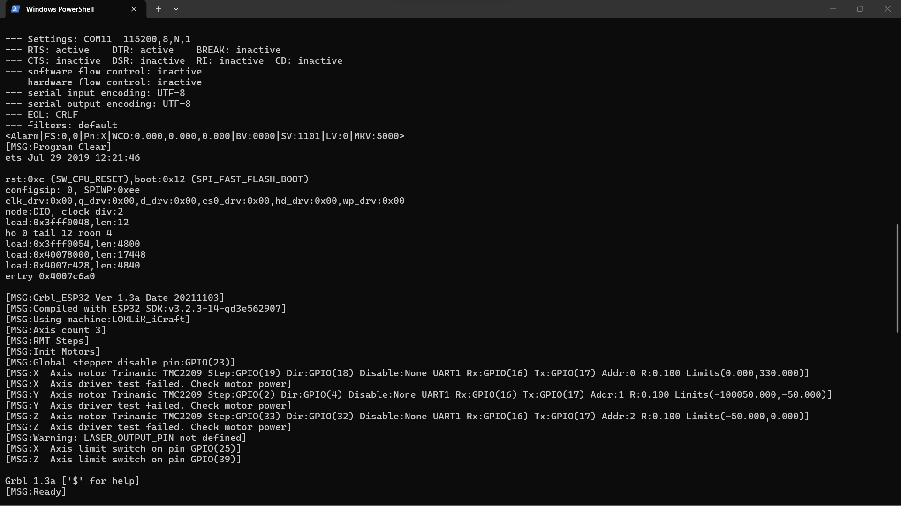
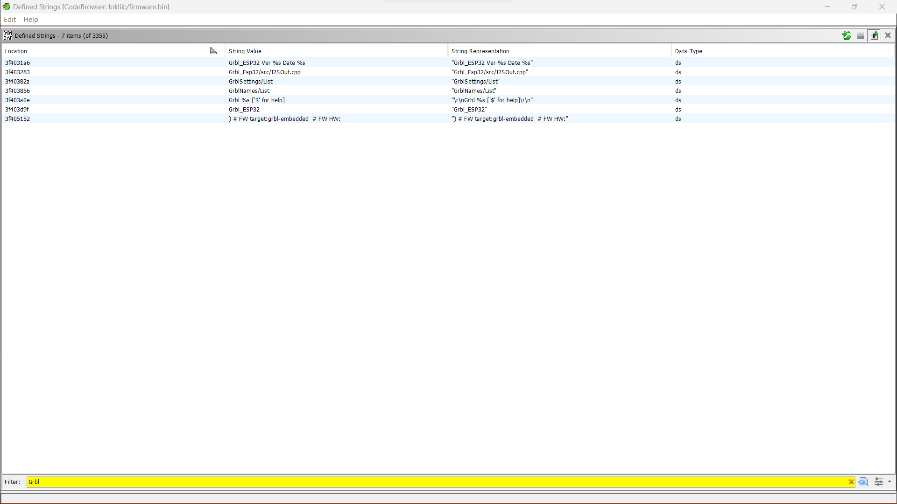
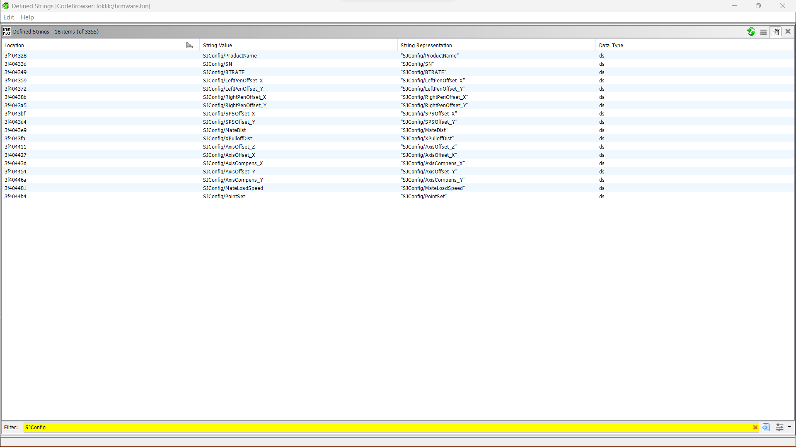
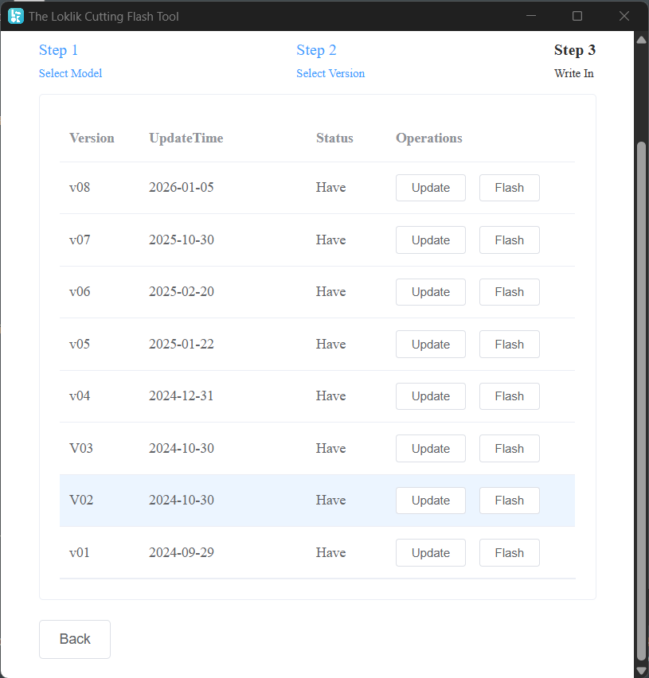
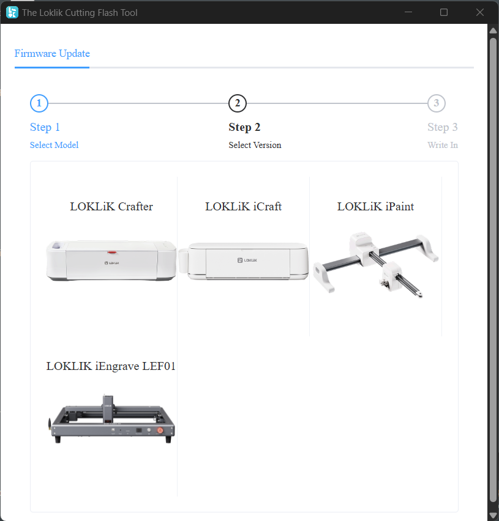

# LOKLiK iCraft — it runs GPLv3 Grbl_ESP32, shipped with no source

The **LOKLiK iCraft** cutting machine is sold as a closed, app-only appliance. Its
controller firmware is in fact a **modified build of [Grbl_Esp32](https://github.com/bdring/Grbl_Esp32)** —
open-source CNC firmware licensed under the **GNU GPL version 3**. The vendor distributes
it locked behind a login app, with their own modifications on top, and provides **no source
code and no attribution** — which the GPLv3 requires.

This repository documents that, and mirrors the firmware so anyone can verify it
independently. Full writeup: **<https://jmscnc.com/kilkol>**

---

## What this repo is — and isn't

- ✅ It **redistributes the GPLv3 firmware binaries** the vendor ships. The GPLv3 expressly
  permits redistribution, so this is allowed — it's the whole point of the license.
- ✅ It documents the **compliance gap** with reproducible evidence.
- ❌ It is **NOT** "the source." The **Complete Corresponding Source** — the modified
  Grbl_Esp32 tree, the `LOKLiK_iCraft` machine definition, the `SJConfig` layer, and the
  build/flash scripts — is exactly what the vendor is obligated to publish and has not.

This is a software-license-compliance matter. The ask is simple: **release the source.**

---

## The evidence, in one minute

**It says its own name on boot:**



```
[MSG:Grbl_ESP32 Ver 1.3a Date 20211103]
[MSG:Using machine:LOKLiK_iCraft]
```

**Its own source path is compiled into the binary** (`Grbl_Esp32/src/I2SOut.cpp`):



**The version is an exact match to upstream.** Grbl_Esp32's source (`Grbl_Esp32/src/Grbl.h`)
defines:

```c
const char* const GRBL_VERSION       = "1.3a";
const char* const GRBL_VERSION_BUILD = "20211103";
```

The device prints `Ver 1.3a Date 20211103` — character for character. It's a build of that
exact upstream release, not a coincidence. And every Grbl_Esp32 file carries the GPL header:

> "Grbl is free software: you can redistribute it and/or modify it under the terms of the
> GNU General Public License ... either version 3 of the License, or (at your option) any
> later version."

**The vendor's modifications** — an `SJConfig` settings namespace that exists nowhere in
upstream (`SJ` = the vendor's `com.sjtech` namespace): serial number, product name, dual-pen
offsets, axis offset/compensation. 18 keys in v01–v06, expanded to 62 in v07–v08.



**Distributed locked, with no source, across the whole product line.** The vendor's own
FlashTool downloads eight versions, dated through 2026-01:



…and flashes the entire lineup from one tool:



---

## The firmware files

All eight versions identify as `Grbl_ESP32 Ver 1.3a`, target machine `LOKLiK_iCraft`, and
carry the `SJConfig` layer. SHA-256 hashes are recorded so the artifacts can't be quietly
swapped (`evidence/SHA256SUMS.txt` — verify with `sha256sum -c`).

| Version | Size (bytes) | Grbl | SJConfig keys | File |
|---|---|---|---|---|
| v01 | 1,562,832 | 1.3a | 18 | [`evidence/firmware_v01.bin`](evidence/firmware_v01.bin) |
| v02 | 1,563,824 | 1.3a | 18 | [`evidence/firmware_v02.bin`](evidence/firmware_v02.bin) |
| v03 | 1,565,200 | 1.3a | 18 | [`evidence/firmware_v03.bin`](evidence/firmware_v03.bin) |
| v04 | 1,565,232 | 1.3a | 18 | [`evidence/firmware_v04.bin`](evidence/firmware_v04.bin) |
| v05 | 1,565,664 | 1.3a | 18 | [`evidence/firmware_v05.bin`](evidence/firmware_v05.bin) |
| v06 | 1,565,728 | 1.3a | 18 | [`evidence/firmware_v06.bin`](evidence/firmware_v06.bin) |
| v07 | 1,219,808 | 1.3a | 62 | [`evidence/firmware_v07.bin`](evidence/firmware_v07.bin) |
| v08 | 1,219,744 | 1.3a | 62 | [`evidence/firmware_v08.bin`](evidence/firmware_v08.bin) |

---

## Reproduce it yourself

Nothing here requires taking anyone's word for it — it's reproducible from a retail device
with free tools, and there is no flash encryption. See **[tools/REPRODUCE.md](tools/REPRODUCE.md)**.
The ESP32 Ghidra loader script is **[tools/ESP32_EsptoolLoad.java](tools/ESP32_EsptoolLoad.java)**.

The full formal report (methodology, segment map, evidence appendix) is **[REPORT.md](REPORT.md)**.

---

## Licensing & credit

The firmware here is a build of **Grbl_Esp32**, so it is licensed under the **GPLv3** and is
redistributed under that license. See **[NOTICE.md](NOTICE.md)**.

- Upstream: **[bdring/Grbl_Esp32](https://github.com/bdring/Grbl_Esp32)** by Barton Dring — a
  port of **[Grbl](https://github.com/gnea/grbl)** by Sungeon "Sonny" Jeon.
- License: **[GNU GPL v3](https://www.gnu.org/licenses/gpl-3.0.html)**

This project exists to *support* open source, not to attack a company. The remedy is for the
vendor to do what the license they built on requires: publish the corresponding source.

---

*Writeup & evidence by Rev — JMS CNC · <https://jmscnc.com/kilkol>*
